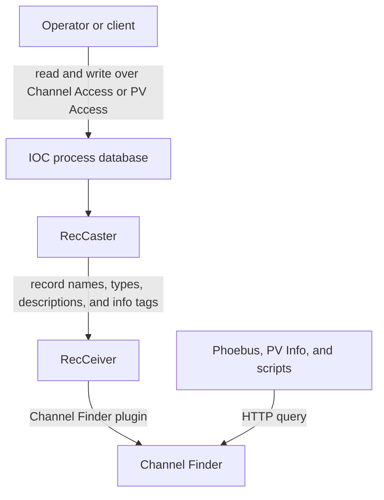

# How Channel Finder is filled

Cited from chapter 3. Roles only. The read and write path does not pass through the directory.

```mermaid
flowchart TB
  db["IOC process database"]
  caster["RecCaster"]
  receiver["RecCeiver"]
  cf["Channel Finder"]
  apps["Phoebus, PV Info, and scripts"]
  op["Operator or client"]

  db --> caster
  caster -->|"record names, types, descriptions, and info tags"| receiver
  receiver -->|"Channel Finder plugin"| cf
  apps -->|"HTTP query"| cf
  op -->|"read and write over Channel Access or PV Access"| db
```
